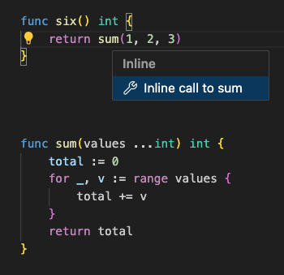
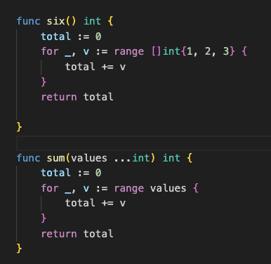

<!-- this doc has been incorporated into features/transformation.md#Rename -->

Gopls v0.14 supports a new refactoring operation:
inlining of function calls.

You can find it in VS Code by selecting a static call to a function or
method f and choosing the `Refactor...` command followed by `Inline
call to f`.
Other editors and LSP clients have their own idiomatic command for it;
for example, in Emacs with Eglot it is
[`M-x eglot-code-action-inline`](https://joaotavora.github.io/eglot/#index-M_002dx-eglot_002dcode_002daction_002dinline)
and in Vim with coc.nvim it is `coc-rename`.

<!-- source code used for images:

func six() int {
	return sum(1, 2, 3)
}

func sum(values ...int) int {
	total := 0
	for _, v := range values {
		total += v
	}
	return total
}
-->



Inlining replaces the call expression by a copy of the function body,
with parameters replaced by arguments.
Inlining is useful for a number of reasons.
Perhaps you want to eliminate a call to a deprecated
function such as `ioutil.ReadFile` by replacing it with a call to the
newer `os.ReadFile`; inlining will do that for you.
Or perhaps you want to copy and modify an existing function in some
way; inlining can provide a starting point.
The inlining logic also provides a building block for
other refactorings to come, such as "change signature".

Not every call can be inlined.
Of course, the tool needs to know which function is being called, so
you can't inline a dynamic call through a function value or interface
method; but static calls to methods are fine.
Nor can you inline a call if the callee is declared in another package
and refers to non-exported parts of that package, or to [internal
packages](https://go.dev/doc/go1.4#internalpackages) that are
inaccessible to the caller.

When inlining is possible, it's critical that the tool preserve
the original behavior of the program.
We don't want refactoring to break the build, or, worse, to introduce
subtle latent bugs.
This is especially important when inlining tools are used to perform
automated clean-ups in large code bases.
We must be able to trust the tool.
Our inliner is very careful not to make guesses or unsound
assumptions about the behavior of the code.
However, that does mean it sometimes produces a change that differs
from what someone with expert knowledge of the same code might have
written by hand.

In the most difficult cases, especially with complex control flow, it
may not be safe to eliminate the function call at all.
For example, the behavior of a `defer` statement is intimately tied to
its enclosing function call, and `defer` is the only control
construct that can be used to handle panics, so it cannot be reduced
into simpler constructs.
So, for example, given a function f defined as:

```go
func f(s string) {
	defer fmt.Println("goodbye")
	fmt.Println(s)
}
```
a call `f("hello")` will be inlined to:
```go
	func() {
		defer fmt.Println("goodbye")
		fmt.Println("hello")
	}()
```
Although the parameter was eliminated, the function call remains.

An inliner is a bit like an optimizing compiler.
A compiler is considered "correct" if it doesn't change the meaning of
the program in translation from source language to target language.
An _optimizing_ compiler exploits the particulars of the input to
generate better code, where "better" usually means more efficient.
As users report inputs that cause the compiler to emit suboptimal
code, the compiler is improved to recognize more cases, or more rules,
and more exceptions to rules---but this process has no end.
Inlining is similar, except that "better" code means tidier code.
The most conservative translation provides a simple but (hopefully!)
correct foundation, on top of which endless rules, and exceptions to
rules, can embellish and improve the quality of the output.

The following section lists some of the technical
challenges involved in sound inlining:

- **Effects:** When replacing a parameter by its argument expression,
  we must be careful not to change the effects of the call. For
  example, if we call a function `func twice(x int) int { return x + x }`
  with `twice(g())`, we do not want to see `g() + g()`, which would
  cause g's effects to occur twice, and potentially each call might
  return a different value. All effects must occur the same number of
  times, and in the same order. This requires analyzing both the
  arguments and the callee function to determine whether they are
  "pure", whether they read variables, or whether (and when) they
  update them too. The inliner will introduce a declaration such as
  `var x int = g()` when it cannot prove that it is safe to substitute
  the argument throughout.

- **Constants:** If inlining always replaced a parameter by its argument
  when the value is constant, some programs would no longer build
  because checks previously done at run time would happen at compile time.
  For example `func index(s string, i int) byte { return s[i] }`
  is a valid function, but if inlining were to replace the call `index("abc", 3)`
  by the expression `"abc"[3]`, the compiler will report that the
  index `3` is out of bounds for the string `"abc"`.
  The inliner will prevent substitution of parameters by problematic
  constant arguments, again introducing a `var` declaration instead.

- **Referential integrity:** When a parameter variable is replaced by
  its argument expression, we must ensure that any names in the
  argument expression continue to refer to the same thing---not to a
  different declaration in the callee function body that happens to
  use the same name! The inliner must replace local references such as
  `Printf` by qualified references such as `fmt.Printf`, and add an
  import of package `fmt` as needed.

- **Implicit conversions:** When passing an argument to a function, it
  is implicitly converted to the parameter type.
  If we eliminate the parameter variable, we don't want to
  lose the conversion as it may be important.
  For example, in `func f(x any) { y := x; fmt.Printf("%T", &y) }` the
  type of variable y is `any`, so the program prints `"*interface{}"`.
  But if inlining the call `f(1)` were to produce the statement `y :=
  1`, then the type of y would have changed to `int`, which could
  cause a compile error or, as in this case, a bug, as the program
  now prints `"*int"`. When the inliner substitutes a parameter variable
  by its argument value, it may need to introduce explicit conversions
  of each value to the original parameter type, such as `y := any(1)`.

- **Last reference:** When an argument expression has no effects
  and its corresponding parameter is never used, the expression
  may be eliminated. However, if the expression contains the last
  reference to a local variable at the caller, this may cause a compile
  error because the variable is now unused! So the inliner must be
  cautious about eliminating references to local variables.

This is just a taste of the problem domain. If you're curious, the
documentation for [github.com/gnoverse/gnopls/internal/refactor/inline](https://pkg.go.dev/github.com/gnoverse/gnopls/internal/refactor/inline) has
more detail. All of this is to say, it's a complex problem, and we aim
for correctness first of all. We've already implemented a number of
important "tidiness optimizations" and we expect more to follow.

Please give the inliner a try, and if you find any bugs (where the
transformation is incorrect), please do report them. We'd also like to
hear what "optimizations" you'd like to see next.
